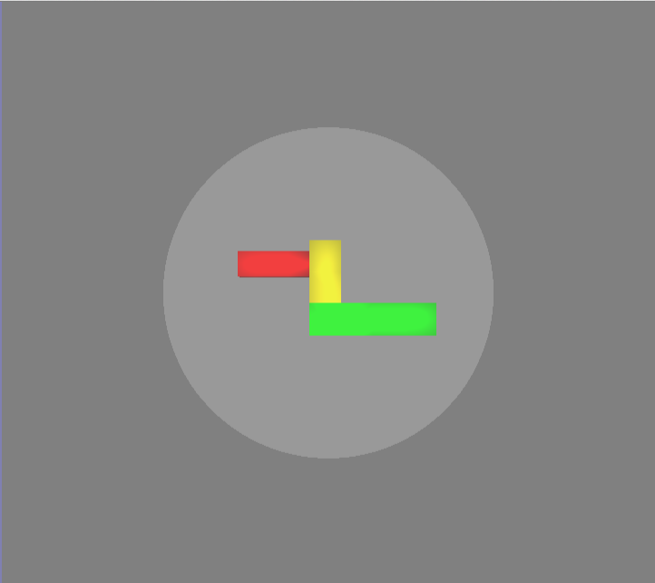

# Arcball

As shown above, in the Arcball Controller the model is centered within a 3D sphere. To rotate the object, you hold down the left mouse button and move the mouse along the surface of the sphere. The object will move as if you are pushing the sphere the direction you're moving the mouse. While rotating, the sphere will become more opaque.

Some example moves and responses,

- LMB  + moving up along the sphere: model will rotate up
- LMB  + moving left along the sphere: model will rotate left
- LMB  + moving diagonally along the sphere: model will move diagonally according to the direction you trace out with the mouse
- LMB  + moving clockwise/anti-clockwise along the edge of the sphere: model will move clockwise/anti-clockwise

## Tips

- Try "grabbing" a piece of the model and then dragging it to where it should be.
- Try orientate the model vertically and horizontally first. Only try to do the clockwise rotation last.

## What's next

You will now start three minutes of training for the Arcball controller. After that, you will start the evaluation of the controller.
