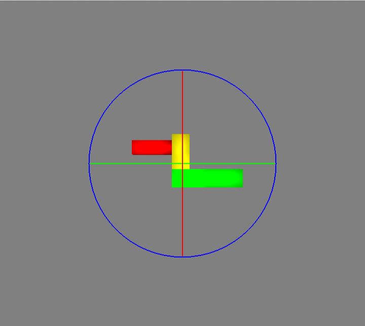

# Rotation Controllers

## General

In this experiment, you will be using a number of different rotation controllers. A rotation controller is a user interface which allows you to rotate a shape on screen using the mouse. Each of the rotation controllers will be operated entirely by pressing and holding the left mouse button and moving the mouse. The shape on the screen is known as a model.  

Each of the different controllers has a slightly different interface. Each of them has their own way of letting you rotate objects left, right, up, down, clockwise and anti-clockwise. Some of them allow you to rotate objects in diagonal directions too. Below we go through all the different controllers one by one, looking at how to use them to rotate the models.

## Two Axis Valuator

As shown above, in the Two Axis Valuator Controller the model is centered within a yellow circle. To rotate an object, hold down the left mouse button down and move the mouse. If you do this, the yellow circle will turn white.

How the object rotates depends on whether you are rotating inside or outside the circle:

- If you try rotate the object with your mouse __within the circle__, the model will rotate according to your mouse. If you move the mouse left or right, the model will rotate left or right. If you move the mouse up or down, the model will rotate up or down. Similarly, you try move the mouse in a diagonal direction, the object will rotate according to that direction.
- If you try rotate the object with your mouse __outside the circle__, the model will rotate clockwise or anticlockwise depending on what direction you move your mouse.

## Arcball

As shown above, in the Arcball Controller the model is centered within a 3D sphere. To rotate the object, you hold down the left mouse button and mouse the mouse along the surface of the sphere. The object will move as if you have push the object along the path the mouse is making. When rotating, the sphere will become more opaque. For example,

- If you try rotate by moving the mouse upwards along the sphere, the object will rotate upwards. 
- If you try rotate by moving the mouse leftwards along the sphere, the object will rotate leftwards.
- If you try rotate by moving the mouse in a diagonal direction along the sphere, the object will rotate diagonally according to the direction you trace out with the mouse.
- To rotate an object clockwise or anti-clockwise, you can move the mouse right or left respectively along the outside edge of the sphere.

## Discrete

As shown above, in the Discrete Controller the model is centered within three coloured sliders. Each slider allows you to rotate the object in a different direction. Additionally, if you try rotate between the sliders, you can rotate using the Arcball controller. This means that  

- to rotate the object left/right, you can hold down the left mouse button on the green slider and move the mouse left or right.
- to rotate the object up/down, you can hold the left mouse button on the red slider and move the mouse up or down.
- to rotate the object clockwise/anti-clockwise, you can hold the left mouse button on the blue slider and move the mouse clockwise or anti-clockwise.
- to rotate the object in an arbitrary direction, you have hold the left mouse button in between the coloured sliders and rotate the model using the Arcball controller (see the instructions in the previous section for how to do this).
