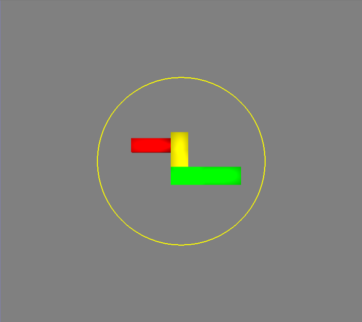

# Rotation Controllers

## General

In this experiment, you will be using three different rotation controllers. A _rotation controller_ is a user interface element which allows you to rotate a shape called a _model_. Each of the different controllers has a different look and way to rotate a model. In the following sections, we explain how to use each of the controllers to rotate objects. In all the controllers, you rotate a model by pressing and holding the left mouse button and moving the mouse. The model will be rotated as soon as you start moving the mouse. This gives you instant feedback and allows you to perform many different rotations one after the other. 

To make the writing of the manual more concise an abbreviation. When you see"LMB ", that means pressing and holding the left mouse button. Whatever follows this is an instruction about the type of mouse movement for that type of rotation. After this motion you complete that motion, you should lift the mouse button. So, for example

LMB  + Moving up 

means holding down the left mouse button while moving the mouse towards the top of the screen, then releasing the left mouse button.

When your mouse is over certain places or you are undertaking certain actions, it will change. To avoid panic, here are what the different cursors means:

- : starting a rotating in this area will allow you to rotate the model in a number of different directions.
- : starting a rotation in this area will allow you to rotate in one direction.
- : if this appears, then you are currently rotating the model. 

## Two Axis Valuator

As shown above, in the Two Axis Valuator Controller the model is centered within a yellow circle. To rotate the model, hold down the left mouse button down and move the mouse. If you do this, the yellow circle will turn white.

How the model rotates depends on whether you are moving the mouse inside or outside the circle:

### Inside the circle
LMB  + Moving inside the circle: the model will rotate in cardinal directions according to your mouse.

- LMB  + left/right inside the circle: model will rotate left/right
- LMB  + up/down inside the circle: model will rotate up/down

You can also combine motions: if you hold the mouse down, and move it (within the circle) first left, then up then diagonally then the model will rotate left, right and diagonally along with your motions. 

### Outside the circle
LMB  + Moving outside the circle: the model will rotate clockwise or anticlockwise depending on what direction you move your mouse.

- LMB  + clockwise outside the circle: model will rotate clockwise
- LMB  + anti-clockwise outside the circle: model will rotate anti-clockwise

## Arcball

As shown above, in the Arcball Controller the model is centered within a 3D sphere. To rotate the object, you hold down the left mouse button and mouse the mouse along the surface of the sphere. The object will move as if you have push the object along the direction you're moving the mouse. When rotating, the sphere will become more opaque. For example,

- LMB  + moving up along the sphere: model will rotate upwards
- LMB  + moving left along the sphere: model will rotate leftwards
- LMB  + moving diagonally along the sphere: model will move diagonally according to the direction you trace out with the mouse
- LMB  + moving clockwise/anti-clockwise along the edge of the sphere: model will move clockwise/anti-clockwise

## Discrete

In the Discrete Controller the model is centered within three coloured sliders. Each slider allows you to rotate the object in a different direction. If you try select between the sliders, you can rotate using the Arcball controller. If you rotate using a slider the slider will turn white. If you rotate using the Arcball controller, the sphere inside the sliders will become more opaque.

- LMB  on the green slider + moving left/right: model will rotate left/right
- LMB  on the red slider + moving up/down: model will rotate up/down
- LMB  on the blue slider + moving clockwise/anticlockwise: model will rotate clockwise/anticlockwise
- LMB  in between the sliders + moving in any direction: model will rotate in the direction you move it (see the previous section on the Arcball controller).
