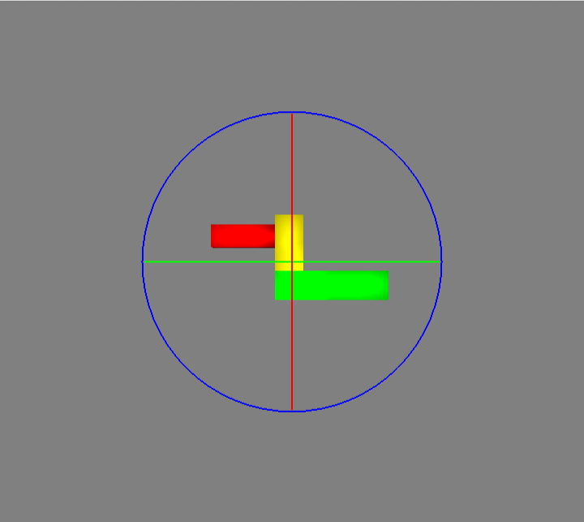

# Discrete

In the Discrete Controller, the model is centered within three coloured sliders. Each slider allows you to rotate the object in a different direction. If you try select between the sliders, you can rotate using the Arcball controller. If you rotate using a slider the slider will turn white. If you rotate using the Arcball controller, the sphere inside the sliders will become more opaque.

If you haven't yet, please consult the section of the hard copy manual describing the Arcball controller.

- LMB  on the green slider + moving left/right: model will rotate left/right
- LMB  on the red slider + moving up/down: model will rotate up/down
- LMB  on the blue slider + moving clockwise/anticlockwise: model will rotate clockwise/anticlockwise
- LMB  in between the sliders + moving in any direction: model will rotate in the direction you move it (see the hard copy manual on the Arcball controller).

## Tips

- Try using the Arcball controller to get the model roughly where you want it. Then, use the sliders to position it accurately.
- Try positioning the model one axis at a time, using each slider in turn. 

## What's next

You will now start 3 minutes of training for the Discrete controller. After that, you will start the evaluation of the controller.
