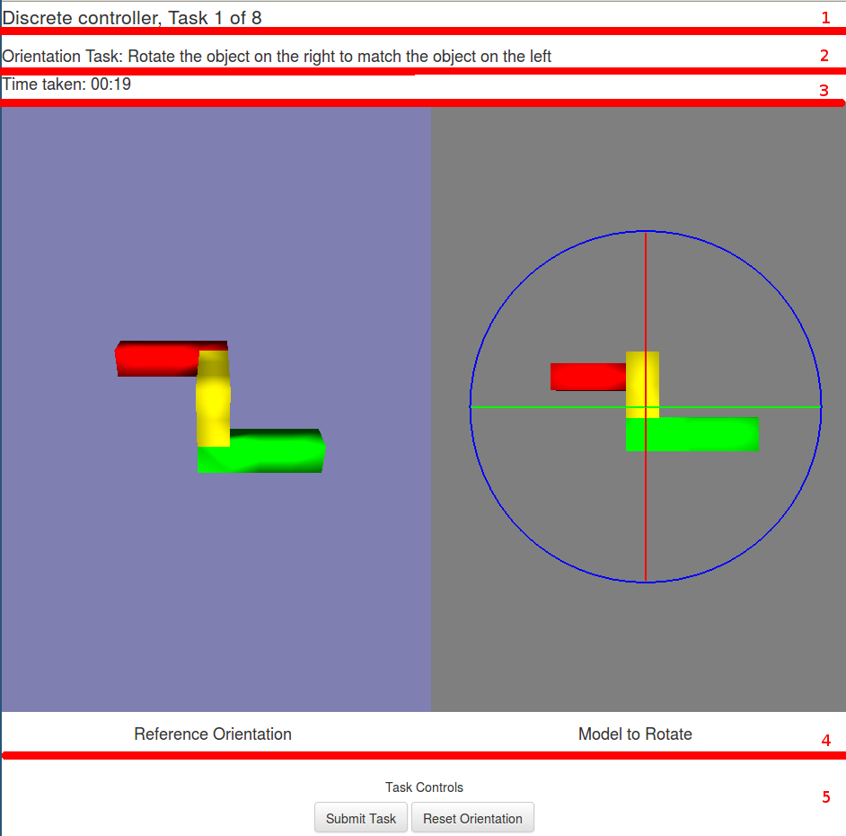
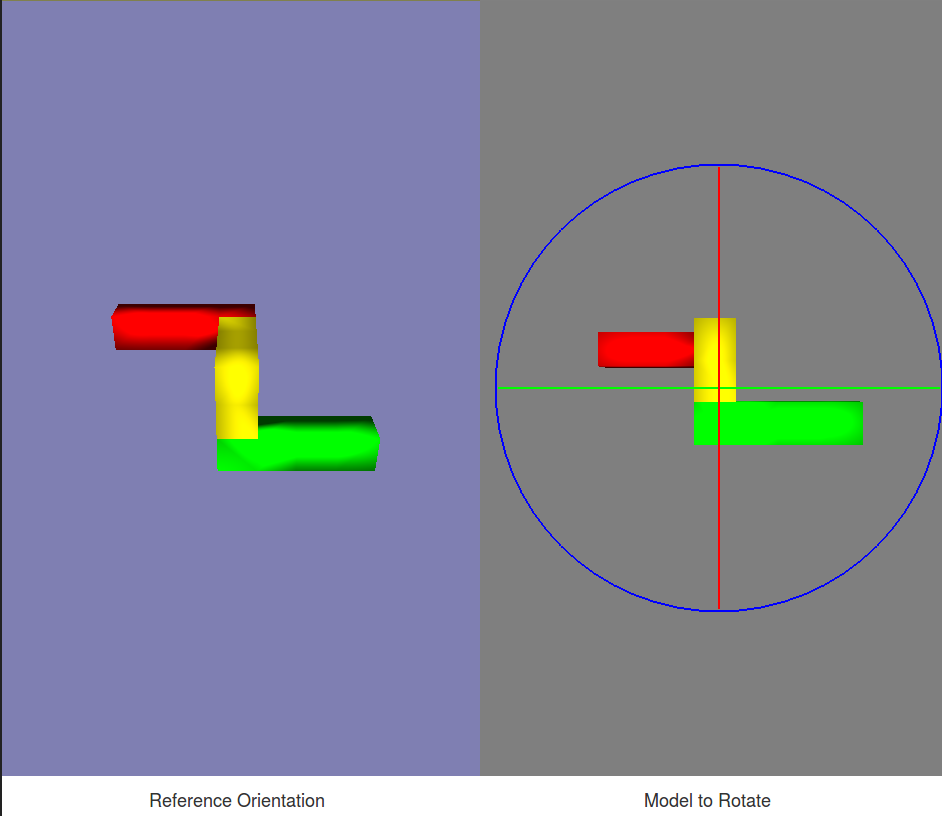
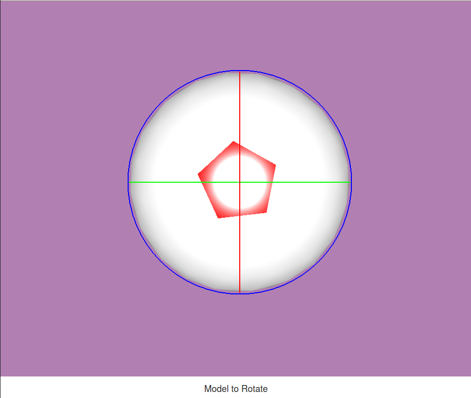

# Evaluation Documentation

## Introduction

We would like to thank you for taking part in our evaluation. In this evaluation, you will be evaluating three different three dimensional user interfaces (3DUIs). These UIs are called "rotation controllers" as they allow you to rotate three dimensional shapes. You will be doing this by completing tasks which will be presented to you.

Please know that in this evaluation we are testing the interface, not you. If you are having trouble navigating the interface, then that is not a problem with your understanding. It is a problem with our interface. If you get stuck and are not sure of how to proceed, please ask the evaluation coordinator present for help. If you would like to end the experiment at anytime, you are welcome to do so. 

For each task you are asked to complete, please do so accurately and quickly.

## Outline of the evaluation procedure

The procedure of the evaluation is as follows. The evaluation coordinator will will be directing this process. 

1. If you have not yet filled in the SRRA, you will be given time to do so.
2. You will be asked to complete a Mental Rotations Test (MRT) on the computer you are in front of. 
3. You will then be asked to complete some tasks using different rotation controllers. The documentation for the rotation controllers is presented in another booklet. The documentation for the types of tasks you will be asked to do is presented below.
4. Finally, you will be asked to fill in some questionnaires about those rotation controllers.

## Tasks

### Interface

The experimental interface has five sections. In the above, we have divided in into several vertical sections which we have explained below.

1. __Title__: The title gives you the current controller you are testing, along with how many tasks you have left. Here, we are testing the Discrete Controller (shown in the _Model to Rotate_ screen in section 4) and we are on task 1 of 8.
2. __Instructions__: This section gives you instructions for how to complete the current task. Here we can see we are completing an _Orientation Task_ where we have to rotate an object to match the orientation of another object. More full instructions for the types of tasks are given below.
3. __Time taken__: This is a timer showing the time taken for the current task. 
4. __3D Views__: This section contains the 3D rendered scenes. This view depends on the type of task being completed, and the rotation controller being used.
5. __Task Controls__: These buttons allow you to 
    -  _Submit Task_: submit the current task when you have completed it.
    - _Reset Orientation_: Reset the orientation of your model to its starting orientation.

### Orientation Matching

Orientation matching tasks involve you rotating a model to match the orientation of another model. You will be presented with two views:

- __Reference Orientation__: This is the orientation that you want to manipulate your model to match.
- __Model to Rotate__: This is the model you will be rotating to match the _Reference Orientation's_ model.

Please look at the controller documentation for how to manipulate the models.

### Inspection

Inspection matching tasks involve you trying to find a red patch on the model you're rotating. Here, there is only one screen: __Model to Rotate__. You must rotate this model until you find the red patch as shown in the image above.

Please look at the controller documentation for how to manipulate the models.
