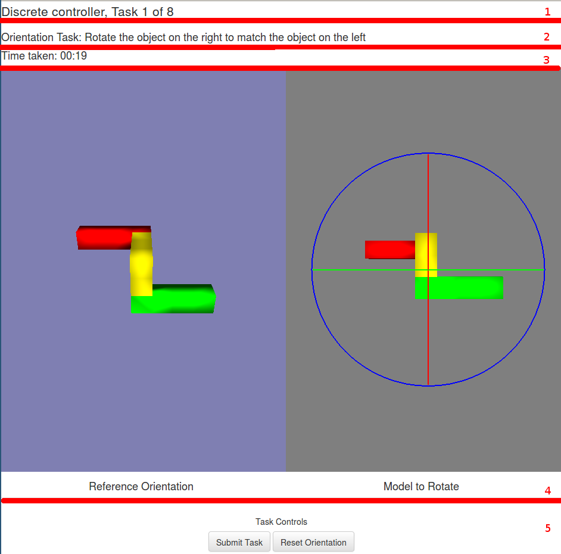
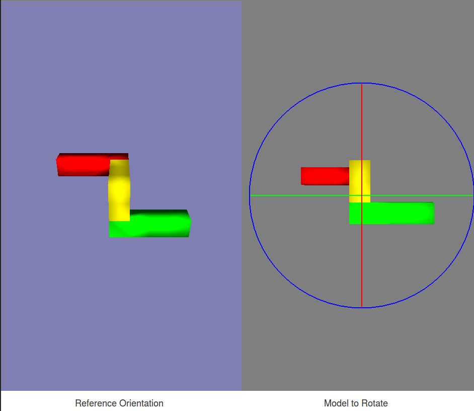

# Tasks

Here we describe the interface as a whole, along with how to complete each task.

## Training and Evaluation

To give you time to familiarise yourself with the controller, you will be given 3 minutes training time before the evaluation begins. In this time, you should try complete the given tasks as quickly and accurately as you can to practice for the evaluation. If you finish the given tasks before the time limit elapses, it will restart at Task 1.

After training concludes, you will start the evaluation of the controller. Here, you will be given no time limit and will be asked to complete 12 tasks. Please complete these tasks as quickly and accurately as you can. 

Training will always preceed an evaluation. The stage you are in will always be shown at the top of the page, along with the controller and the number of tasks you have left.

## Interface

The experimental interface has five sections. In the above, we have divided in into several vertical sections which we have explained below.

1. __Title__: The title gives you the current controller you are testing, along with how many tasks you have left. Here, we are in the training stage of using the Discrete Controller and we are on task 1 of 11.
2. __Instructions__: This section gives you instructions for how to complete the current task. Here we can see we are completing an _Orientation Task_ where we have to rotate an object to match the orientation of another object. More full instructions for the types of tasks are given below.
3. __Time Left__: This is a timer showing the time left for the current stage. This is only shown for training stages, as there is no time limit for evaluations. 
4. __3D Views__: This section contains the 3D rendered scenes. This view depends on the type of task being completed, and the rotation controller being used.
5. __Reference Orientation__: See the section on Orientation Tasks below.
6. __Model to Rotate__: See the section on Orientation Tasks below.
7. __Reset Model orientation__:Reset the orientation of your model to its starting orientation. 
8. __Submit Task__:  Once you have completed the task, submit the task and start the next one.

## Orientation Matching

Orientation matching tasks involve you rotating a model to match the orientation of another model. You will be presented with two views:

- __Reference Orientation__: This is the orientation that you want to manipulate your model to match.
- __Model to Rotate__: This is the model you will be rotating to match the _Reference Orientation's_ model.

## Inspection

Inspection matching tasks involve you trying to find a red patch on the model you're rotating. Here, there is only one screen: __Model to Rotate__. You must rotate this model until you find the red patch as shown in the image above. Once you have, you should position the center of the controller on that red patch as shown above. The center of the controller is marked with a small black square. 
