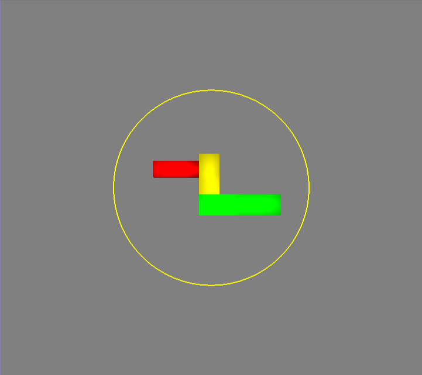

# Two Axis Valuator

As shown above, in the Two Axis Valuator Controller the model is centered within a yellow circle. To rotate the model, hold down the left mouse button down and move the mouse. If you do this, the yellow circle will turn white.

How the model rotates depends on whether you are moving the mouse inside or outside the circle:

## Inside the circle
LMB  + Moving inside the circle: the model will rotate in cardinal directions according to your mouse.

- LMB  + left/right inside the circle: model will rotate left/right
- LMB  + up/down inside the circle: model will rotate up/down

You can also combine motions: if you hold the mouse down, and move it (within the circle) first left, then up then diagonally then the model will rotate left, right and diagonally along with your motions. 

## Outside the circle
LMB  + Moving outside the circle: the model will rotate clockwise or anticlockwise depending on what direction you move your mouse.

- LMB  + clockwise outside the circle: model will rotate clockwise
- LMB  + anti-clockwise outside the circle: model will rotate anti-clockwise
